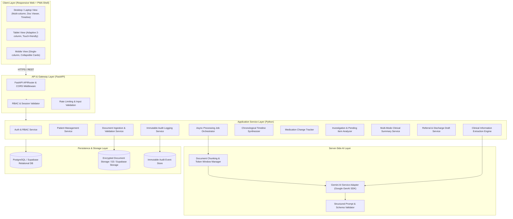
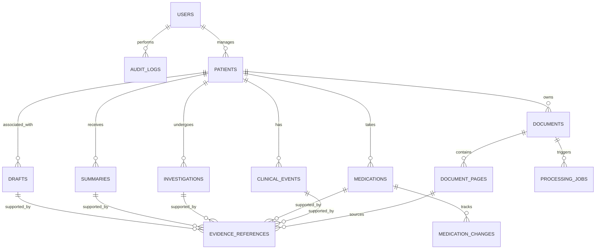
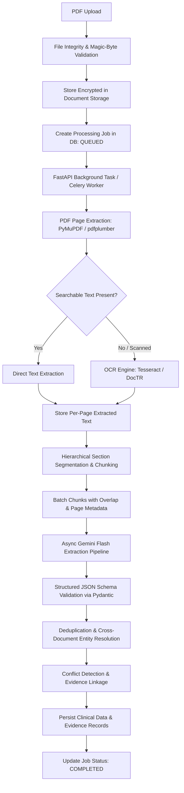
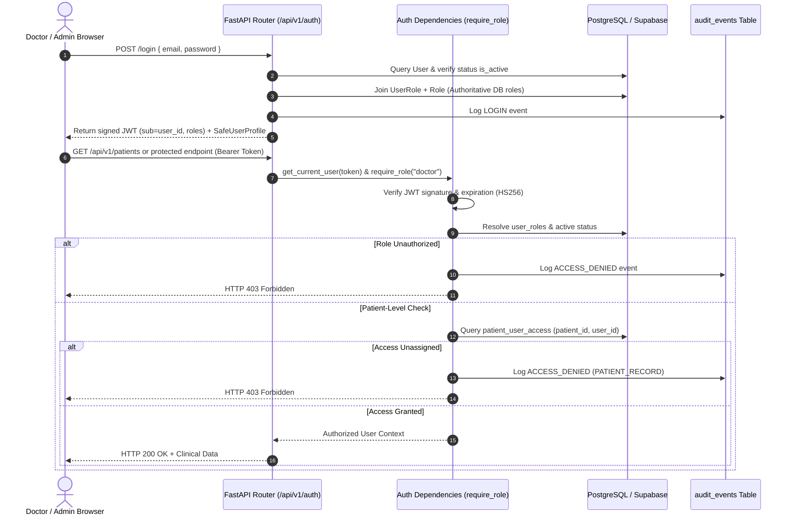

# 🏛️ MedBrief AI — System Architecture Specification

> **Product**: MedBrief AI — Intelligent Medical Summarization  
> **Problem Statement**: P3 — Medical Report Summarisation Assistant  
> **Current Development Phase**: Step 2 — System Architecture  

---

## 1. Executive Architecture Summary

MedBrief AI is designed as a **clinician-centric, evidence-first, highly auditable medical intelligence platform**. The architecture bridges complex, unstructured, multi-document clinical records (ranging from 1 to 200+ pages) into structured, chronologically indexed, and actionable clinical summaries. 

### Core Architectural Principles
1. **Evidence-First Traceability**: Every clinical assertion, medication change, or timeline event links directly to its source document, page number, and source text snippet.
2. **Conflict Preservation**: Conflicting data across documents (e.g. differing dosages or diagnoses) is preserved and flagged for physician review, never silently overwritten or arbitrarily resolved by AI.
3. **Strict Doctor-in-the-Loop**: AI outputs (summaries, next steps, referral/discharge letters) remain **drafts** until explicitly validated and approved by an authorized clinician.
4. **Server-Side AI Isolation**: All Gemini AI interactions occur strictly on the Python FastAPI backend. No API keys or AI client libraries exist on the frontend.
5. **Multi-Device Responsive Web + PWA Ready**: A single responsive React + TypeScript application engineered for Desktop, Laptop, Tablet, and Mobile form factors without code duplication.
6. **Zero Insecure Offline Medical Caching**: No patient health information (PHI) is cached insecurely in service workers or local browser storage.

---

## 2. Target High-Level System Architecture



---

## 3. Frontend Architecture (React 19 + TypeScript)

The frontend is structured as a modular, component-driven Single Page Application (SPA) designed to transition into a Progressive Web App (PWA).

### Directory & Component Hierarchy
```
src/frontend/src/
├── assets/                  # Brand assets, vectors, and icons
├── components/              # Modular UI components
│   ├── MedBriefIntro/       # Branded cinematic intro (Step 1)
│   ├── common/              # Universal design system components
│   │   ├── Badge/           # Status and certainty indicators
│   │   ├── Button/          # Accessible button variants
│   │   ├── Card/            # Clinical section cards
│   │   ├── Modal/           # Accessible modals & overlays
│   │   └── Table/           # Responsive data tables
│   ├── layout/              # Shell, responsive headers, sidebars
│   │   ├── AppHeader/       # Global navigation and role indicator
│   │   ├── Sidebar/         # Collapsible desktop/tablet sidebar
│   │   └── MobileNav/       # Bottom navigation for mobile viewports
│   ├── patient/             # Patient list, profile, and demographics
│   ├── document/            # Document uploader, page thumbnail viewer, PDF renderer
│   ├── timeline/            # Chronological clinical event stream
│   ├── medication/          # Medication comparison cards & change badges
│   ├── investigation/       # Completed vs. pending investigation trackers
│   ├── summary/             # Tabbed multi-mode clinical summary panels
│   ├── evidence/            # Source snippet drawer & citation popovers
│   └── draft/               # Referral & discharge editor with doctor sign-off
├── hooks/                   # Custom React hooks (useAuth, usePatient, useTimeline)
├── services/                # Type-safe API client wrappers (Axios / Fetch)
├── types/                   # TypeScript interfaces matching backend schemas
└── utils/                   # Formatting, date utilities, evidence linkers
```

### State Management Strategy
- **Server Cache & Async State**: Lightweight query hooks for server state (patients, documents, job status) with polling for asynchronous processing jobs.
- **Local UI State**: React standard `useState` and `useReducer` for document viewer zoom, active tab selections, timeline filters, and draft text editing.
- **Doctor Review State**: Dedicated dirty-checking state for uncommitted clinician edits on AI summaries and drafts.

---

## 4. Responsive Multi-Device Architecture

MedBrief AI operates as **one unified responsive web application** dynamically adapting across viewports without redundant codebases:

| Feature | Desktop (≥1200px) | Laptop (1024px–1199px) | Tablet (768px–1023px) | Mobile (<768px) |
|---|---|---|---|---|
| **Navigation** | Fixed persistent sidebar | Collapsible left rail | Drawer navigation | Bottom tab bar & hamburger |
| **Workspace Layout** | 3-Column (Nav / Document Viewer / Summary & Evidence) | 2-Column (Document Viewer / Tabbed Summary) | 2-Column adaptive or stacked view | 1-Column stacked view with smooth tab switching |
| **Document Viewer** | Side-by-side split screen with synced page highlights | Side-by-side or overlay | Embedded full-width with gesture zoom | Sheet/Modal overlay with page jump |
| **Evidence Inspection** | Pinned right-hand evidence drawer | Sliding drawer | Popover sheet | Bottom modal sheet |
| **Timeline Display** | Dual-track vertical timeline with category filters | Single-track vertical timeline | Compressed timeline cards | Accordion-grouped chronological cards |
| **Touch Targets** | Standard mouse targets (32px) | Standard mouse targets (36px) | Touch-optimized (≥44px) | Touch-optimized (≥48px) |

---

## 5. PWA Architecture & Safety Guidelines

- **App Shell**: Minimal HTML5/CSS shell cached for instantaneous loading on unstable hospital Wi-Fi.
- **Web App Manifest**: Provides standalone display mode, orientation lock for tablets, official brand icons, and clinical palette theme (`#08172e`).
- **Service Worker Security Policy**:
  - ✅ **Allowed to Cache**: Application shell, static JavaScript bundles, CSS stylesheets, fonts, and brand SVGs.
  - ❌ **STRICTLY PROHIBITED FROM CACHING**: Patient demographic records, clinical summaries, document text, OCR results, and source PDF binaries.
  - **Rationale**: Hospital shared workstations and personal mobile devices must never retain unencrypted clinical data in browser storage.

---

## 6. Backend Layered Architecture (Python + FastAPI)

The backend adheres to a strict four-tier separation of concerns:

```
src/backend/
├── api/                     # Layer 1: API Route Handlers (FastAPI Routers)
│   ├── v1/
│   │   ├── auth.py          # /api/v1/auth
│   │   ├── patients.py      # /api/v1/patients
│   │   ├── documents.py     # /api/v1/documents
│   │   ├── processing.py    # /api/v1/processing
│   │   ├── clinical.py      # /api/v1/clinical
│   │   ├── medications.py   # /api/v1/medications
│   │   ├── investigations.py# /api/v1/investigations
│   │   ├── timeline.py      # /api/v1/timeline
│   │   ├── summaries.py     # /api/v1/summaries
│   │   ├── evidence.py      # /api/v1/evidence
│   │   └── drafts.py        # /api/v1/drafts
├── services/                # Layer 2: Business Logic & Orchestration
│   ├── auth_service.py
│   ├── patient_service.py
│   ├── document_service.py
│   ├── processing_service.py
│   ├── extraction_service.py
│   ├── timeline_service.py
│   ├── conflict_service.py
│   ├── summary_service.py
│   ├── draft_service.py
│   └── audit_service.py
├── ai/                      # Layer 3: AI Engine & Provider Abstraction
│   ├── gemini_client.py     # Server-side Gemini SDK integration
│   ├── prompts/             # Versioned clinical prompts & system instructions
│   ├── chunking.py          # Sliding-window & page-level chunker
│   └── parsers.py           # Structured JSON extractor & validation
├── db/                      # Layer 4: Data Access & Repositories
│   ├── connection.py        # Database engine & session maker
│   ├── models/              # SQLAlchemy / SQLModel ORM entities
│   └── repositories/        # Query repositories isolating SQL logic
├── domain/                  # Pure Domain Entities & Data Contracts
│   └── contracts.py         # Pydantic input/output schemas
└── main.py                  # Entrypoint, CORS, exception handlers
```

---

## 7. API Architecture Specification

All endpoints reside under `/api/v1` and return standardized JSON responses.

### Summary of API Domains
| API Domain | Base Route | Key Responsibilities | Auth Required |
|---|---|---|---|
| **Auth & RBAC** | `/api/v1/auth` | Login, token refresh, current clinician identity, role verification | None (login) / Bearer |
| **Patients** | `/api/v1/patients` | Patient CRUD, demographics, multi-document patient linking | Bearer (Doctor/Admin) |
| **Documents** | `/api/v1/documents` | Upload PDF, fetch metadata, page manifests, signed URLs | Bearer (Doctor/Admin) |
| **Processing** | `/api/v1/processing` | Trigger extraction jobs, poll job status, cancel/retry jobs | Bearer (Doctor/Admin) |
| **Clinical Data** | `/api/v1/clinical` | Query extracted clinical entities, allergies, diagnoses | Bearer (Doctor/Admin) |
| **Medications** | `/api/v1/medications` | Medication regimen, dosage changes, discontinued items | Bearer (Doctor/Admin) |
| **Investigations** | `/api/v1/investigations`| Completed lab/imaging reports vs. pending/outstanding tests | Bearer (Doctor/Admin) |
| **Timeline** | `/api/v1/timeline` | Unified chronological clinical event stream | Bearer (Doctor/Admin) |
| **Summaries** | `/api/v1/summaries` | Generate & retrieve Quick, Detailed, and Specialty summaries | Bearer (Doctor/Admin) |
| **Evidence** | `/api/v1/evidence` | Fetch source document snippet, page number, and highlight bounds | Bearer (Doctor/Admin) |
| **Drafts** | `/api/v1/drafts` | Generate, edit, and doctor-approve referral/discharge drafts | Bearer (Doctor/Admin) |

---

## 8. Database Conceptual Model

The relational model utilizes PostgreSQL (compatible with Supabase) with strict foreign key integrity, UUID primary keys, and comprehensive indexing.



### Entity Schema Blueprint
- **USERS**: `id (UUID)`, `email`, `hashed_password`, `role (DOCTOR | ADMIN | NURSE)`, `full_name`, `created_at`.
- **PATIENTS**: `id (UUID)`, `mrn (Medical Record Number)`, `first_name`, `last_name`, `dob`, `gender`, `created_by (FK)`.
- **DOCUMENTS**: `id (UUID)`, `patient_id (FK)`, `title`, `document_type (DISCHARGE | LAB | REFERRAL | CLINIC_NOTE)`, `file_path`, `file_size_bytes`, `page_count`, `checksum_sha256`, `uploaded_at`.
- **DOCUMENT_PAGES**: `id (UUID)`, `document_id (FK)`, `page_number`, `extracted_text`, `ocr_applied (BOOL)`, `token_count`.
- **PROCESSING_JOBS**: `id (UUID)`, `document_id (FK)`, `status (QUEUED | PROCESSING | COMPLETED | FAILED | PARTIAL | REQUIRES_REVIEW)`, `error_message`, `progress_percent`, `started_at`, `completed_at`.
- **CLINICAL_EVENTS**: `id (UUID)`, `patient_id (FK)`, `event_date`, `event_type (CONSULTATION | ADMISSION | PROCEDURE | DIAGNOSIS | DISCHARGE)`, `description`, `is_conflict (BOOL)`, `conflict_details (JSON)`.
- **MEDICATIONS**: `id (UUID)`, `patient_id (FK)`, `drug_name`, `dosage`, `frequency`, `route`, `status (ACTIVE | DISCONTINUED | CHANGED)`.
- **MEDICATION_CHANGES**: `id (UUID)`, `medication_id (FK)`, `previous_dosage`, `new_dosage`, `change_type (STARTED | STOPPED | DOSE_CHANGE)`, `reason`, `detected_date`.
- **INVESTIGATIONS**: `id (UUID)`, `patient_id (FK)`, `test_name`, `category (LAB | IMAGING | PATHOLOGY)`, `result_value`, `normal_range`, `status (COMPLETED | PENDING | ORDERED | OVERDUE)`, `ordered_date`, `completed_date`.
- **EVIDENCE_REFERENCES**: `id (UUID)`, `parent_entity_type`, `parent_entity_id`, `document_id (FK)`, `page_number`, `source_snippet`, `confidence_score`.
- **SUMMARIES**: `id (UUID)`, `patient_id (FK)`, `summary_type (QUICK | DETAILED | HANDOFF | SPECIALTY)`, `content_markdown`, `doctor_approved (BOOL)`, `reviewed_by (FK)`, `reviewed_at`.
- **DRAFTS**: `id (UUID)`, `patient_id (FK)`, `draft_type (REFERRAL | DISCHARGE | HANDOFF)`, `generated_content`, `final_content`, `doctor_approved (BOOL)`, `reviewed_by (FK)`.
- **AUDIT_LOGS**: `id (UUID)`, `user_id (FK)`, `action`, `resource_type`, `resource_id`, `ip_address`, `timestamp`.

---

## 9. Patient Architecture (1 Patient : Many Documents)

MedBrief AI strictly decouples patients from individual files. A patient profile aggregates an evolving dossier of medical records:
- **Historical Records**: Prior clinic letters, old discharge notes.
- **Diagnostic Inflow**: Blood tests, pathology reports, imaging scans over time.
- **Prescription Logs**: Dispensation records, acute vs. repeat medication lists.
- **Cross-Document Synthesis**: The patient's active problems, current medication list, and pending tests are synthesized across **all** uploaded documents, maintaining source attribution for each item.

---

## 10. Large Document Processing Pipeline (50–200 Pages)

Large medical records cannot be processed in a single synchronous HTTP request or a single LLM context prompt. The system uses an **asynchronous sliding-window chunking pipeline**:



### Fault-Tolerance Strategy for Large Records
- **Page-Level Checkpointing**: If page 47 fails, pages 1–46 are preserved in the DB.
- **Job Status State Machine**: `QUEUED` $\to$ `PROCESSING` $\to$ `COMPLETED` (or `PARTIAL` / `FAILED` with retry capability).
- **Rate-Limit Resilience**: Exponential backoff with jitter on Gemini API calls.

---

## 11. AI Architecture & Server-Side Gemini Integration

- **Model Tiering Strategy**:
  - **Gemini 1.5 / 2.0 Flash**: Fast, cost-efficient model for page-level extraction, OCR normalization, and entity recognition.
  - **Gemini 1.5 / 2.0 Pro**: High-reasoning model for longitudinal summary synthesis, conflict reconciliation, and referral/discharge drafting.
- **Decoupled AI Service Provider**: An abstract `AIServiceInterface` class ensures MedBrief AI is never locked into one provider:
  ```python
  class AIServiceInterface(ABC):
      @abstractmethod
      async def extract_clinical_entities(self, text: str, page: int) -> StructuredEntities: ...
      @abstractmethod
      async def synthesize_summary(self, context: PatientContext, mode: SummaryMode) -> SummaryOutput: ...
      @abstractmethod
      async def generate_draft(self, context: PatientContext, draft_type: DraftType) -> DraftOutput: ...
  ```

---

## 12. Structured AI Output & Epistemic Classification

All AI generation tasks enforce strict JSON Schema validation. The architecture enforces four distinct epistemic categories to prevent AI hallucinations from polluting medical records:

1. **DOCUMENTED FACT**: An explicit statement directly grounded in the record (e.g., "Creatinine 142 umol/L on 12/03/2026").
2. **AI INTERPRETATION**: Clinical deductions derived from facts (e.g., "Creatinine elevated above baseline suggesting acute kidney injury stage 1").
3. **AI SUGGESTION**: Proposed investigations or monitoring tasks based on clinical guidelines (e.g., "Repeat renal panel within 48 hours recommended").
4. **UNCERTAIN / AMBIGUOUS**: Illegible handwriting or vague notes (e.g., "Dose looks like 20mg or 30mg, unverified").
5. **CONFLICTING DATA**: Inconsistent entries between sources (e.g., "Doc A states Metformin 500mg BD; Doc B states Metformin 1000mg OD").

---

## 13. Evidence-First Architecture

Every extracted data point must carry a pointer to its originating evidence:

```json
{
  "clinical_assertion": "Patient initiated on Apixaban 5mg BD for non-valvular atrial fibrillation",
  "evidence": {
    "document_id": "8f3c4e2b-1123-4e89-a9a3-883391b10a24",
    "document_title": "Discharge_Summary_CityHospital_20260214.pdf",
    "page_number": 3,
    "section": "Discharge Medications",
    "exact_snippet": "Commenced Apixaban 5 mg twice daily for newly diagnosed non-valvular AF.",
    "character_offset": [1420, 1498],
    "confidence": 0.98
  }
}
```

In the UI, clicking any clinical badge or timeline card highlights the exact excerpt and page in the embedded document viewer.

---

## 14. Conflict Detection & Preservation Engine

When conflicting information appears:
1. **Never Overwrite**: Both values are stored with their respective timestamps and evidence references.
2. **Flag as Conflict**: The entity is marked with `is_conflict = True`.
3. **Clinician Notification**: Rendered in the UI with a high-visibility amber badge ("Discrepancy Detected").
4. **Physician Resolution**: The doctor can confirm the active truth, record clinical rationale, or mark both for clarification at next consult.

---

## 15. Clinical Timeline Architecture

Reconstructs the longitudinal clinical journey into a unified, filterable stream:
- **Event Categorization**: Admissions, Consultations, Surgical/Bedside Procedures, Diagnostic Labs, Imaging, Medication Changes, Discharges.
- **Temporal Sorting**: Strict chronological ordering with support for date-uncertain events (e.g. "Reported onset ~3 weeks prior").
- **Interactive Multi-Filter**: Clinicians can filter by event type, date range, or specific organ systems.

---

## 16. Medication Change Tracking Architecture

Tracks the complete pharmacotherapy lifecycle:
- **Status Triggers**: `STARTED`, `STOPPED`, `DOSE_INCREASED`, `DOSE_DECREASED`, `FREQUENCY_CHANGED`, `SUBSTITUTED`.
- **Clinical Rationale Capture**: Links the change reason (e.g., "Discontinued ACE inhibitor due to dry cough").
- **Active Regimen Snapshot**: Provides the clinician with an instant, reconciled current medication list alongside the historical change log.

---

## 17. Investigation Architecture

Separates diagnostic work into two distinct views:
1. **Completed Investigations**: Laboratory panels, radiology findings, pathology reports with normal vs. abnormal flags.
2. **Outstanding / Pending Investigations**:
   - Tests explicitly ordered in clinical notes but without subsequent results in the record.
   - Recommended follow-ups (e.g., "Repeat chest X-ray in 6 weeks").
   - Overdue items highlighted based on clinical urgency.

---

## 18. AI Next-Step & Clinical Recommendations Architecture

Categories evaluated by the clinical assistant:
1. **Pending Investigations** (e.g., Ordered MRI brain outstanding)
2. **Follow-Up Consultations** (e.g., Cardiology clinic in 4 weeks)
3. **Medication Reviews** (e.g., Electrolyte check after initiating ACE inhibitor)
4. **Clinical Issues Requiring Attention** (e.g., Unaddressed borderline troponin elevation)
5. **Specialist Referrals**
6. **Routine Monitoring** (e.g., Diabetic foot exam, HbA1c interval)
7. **Clinical Documentation / Handoff Gaps**

> **Safeguard**: When evidence is incomplete or ambiguous, the AI explicitly returns: *"Insufficient information in the uploaded record to determine next steps."*

---

## 19. Multi-Mode Summary Architecture

MedBrief AI supports specialized summary views tailored to clinical contexts:
- **Quick Clinical Summary**: 60-second executive briefing (chief complaint, active diagnoses, vital trends, high-risk alerts).
- **Detailed Clinical Summary**: Comprehensive systemic review (past history, hospital course, investigations, functional status).
- **Medication Summary**: Tabulated active drugs, recent changes, adverse reactions, and allergies.
- **Investigations Summary**: Longitudinal trends of critical lab values and imaging milestones.
- **Specialty Referral Summary**: Contextualized briefing emphasizing the relevant subspecialty problem.

---

## 20. Referral & Discharge Draft Architecture

- **Two-Tier Document State**:
  - `DRAFT (AI-Generated)`: Watermarked as an unverified machine draft. Read-only for clinical distribution.
  - `APPROVED (Doctor-Signed)`: Clinician edits, signs, and commits the document. Includes reviewer name, medical license ID, and sign-off timestamp.
- **Template System**: Standard clinical layouts (SOAP notes, SBAR handoff, standard NHS/Australian/US referral letter templates).

---

## 21. Authentication & RBAC Architecture
*(Implemented in Step 4)*

### Role-Based Access Control Matrix

| Action | DOCTOR | NURSE / CLINICAL ASST | ADMIN |
|---|---|---|---|
| View Patients & Summaries | ✅ | ✅ | ❌ (No direct PHI without audit assignment) |
| Upload Medical Documents | ✅ | ✅ | ❌ |
| Run AI Summarization | ✅ | ✅ | ❌ |
| Edit & Sign Off Drafts | ✅ | ❌ | ❌ |
| Manage System Users | ❌ | ❌ | ✅ |
| Access Full Audit Logs | ❌ | ❌ | ✅ |

### Server-Side RBAC & Identity Resolution Flow



### Authentication Endpoints
- `POST /api/v1/auth/login`: Authenticates clinical users and issues cryptographically signed JWTs.
- `GET /api/v1/auth/me`: Validates session and returns safe application profile without secrets.
- `POST /api/v1/auth/logout`: Revokes clinical session and records `LOGOUT` in the audit log.
- `GET /api/v1/auth/doctor-access`: Route verification probe requiring server-side `DOCTOR` role.
- `GET /api/v1/auth/admin-access`: Route verification probe requiring server-side `ADMIN` role.
- `GET /api/v1/auth/patient-access/{patient_id}`: Route probe enforcing `patient_user_access` mapping.

---

## 22. Security & Data Protection Architecture

- **Zero Client-Side Secrets**: Gemini API keys and database credentials reside exclusively in server-side environment variables.
- **Transport & Storage Encryption**: TLS 1.3 in transit; AES-256 encryption at rest for documents and database volumes.
- **Strict Tenant & Patient Isolation**: All SQL queries enforce `patient_id` parameterization and clinician permission validation.
- **Data Sanitization**: Fictionalized and synthetic data guidelines during development phases.

---

## 23. Immutable Audit Trail Architecture

All operations write to an append-only audit log:
- **Logged Events**: User Login, Patient Record Accessed, Document Uploaded, OCR Processed, AI Extraction Triggered, Summary Viewed, Draft Generated, Draft Edited, Document Approved, Export Generated.
- **Audit Record Attributes**: `id`, `user_id`, `patient_id`, `action`, `resource_type`, `resource_id`, `ip_hash`, `timestamp_utc`.

---

## 24. Error Handling & Asynchronous Resilience

- **Structured API Error Responses**: Standard RFC 7807 problem details format (`detail`, `code`, `status_code`).
- **Resilient Background Processing**:
  - Timeout protection for OCR and LLM inference.
  - Granular job states: `QUEUED`, `PROCESSING`, `COMPLETED`, `PARTIAL`, `FAILED`, `REQUIRES_REVIEW`.
  - Frontend polling with exponential backoff to eliminate server strain.

---

## 25. Testing & Verification Architecture

- **Backend**: Pytest unit tests for schemas and routers; HTTPX integration tests for endpoints; mock Gemini responses for deterministic testing.
- **Frontend**: Vitest for component logic; Vite build type checking (`tsc -b`); responsive layout regression testing across viewports.
- **AI Verification**: Schema compliance testing, hallucination validation against ground truth source text, and prompt regression testing.

---

## 26. Deployment Architecture

- **Containerization**: Standard Docker container for the FastAPI backend (`python:3.14-slim`).
- **Frontend Hosting**: Static web build served via CDN / static web host with Vite production optimizations.
- **Database**: Managed PostgreSQL instance (Supabase or Cloud SQL).
- **Object Storage**: S3-compatible encrypted bucket for medical PDF documents.

---

## 27. End-to-End Data Flows

### Ingestion & Processing Flow
```
Clinician (Browser)
       │ (1) POST /documents (Upload PDF)
       ▼
FastAPI Backend
       │ (2) Store raw encrypted PDF
       ▼
Encrypted Storage
       │ (3) Create Processing Job (status: QUEUED)
       ▼
Background Worker
       │ (4) PyMuPDF page extraction & OCR if scanned
       │ (5) Chunk document pages (sliding window)
       │ (6) Send chunks to Gemini AI Service (server-side)
       │ (7) Validate structured JSON output via Pydantic
       │ (8) Map evidence citations (doc_id, page, snippet)
       │ (9) Write entities & timeline events to PostgreSQL
       │ (10) Update Job (status: COMPLETED)
       ▼
Clinician Dashboard (Notified via poll/websocket)
```

---

## 28. Comprehensive Mapping to the 19 Development Steps

| Step | Development Milestone | Architectural Role & Alignment |
|---|---|---|
| **Step 1** | **Project Setup + Intro** | Base runtime foundation, React+TS frontend, FastAPI backend, cinematic branded intro. |
| **Step 2** | **System Architecture** | *[Current Phase]* Technical blueprints, contracts, multi-device strategy, security design. |
| **Step 3** | **Database** | PostgreSQL/Supabase schema creation, migrations, ORM entities, indexes, and constraints. |
| **Step 4** | **Authentication / RBAC** | JWT authentication, role guards (Doctor, Nurse, Admin), session management. |
| **Step 5** | **Doctor Dashboard UI** | Multi-column responsive layout, clinical summary cards, patient activity feeds. |
| **Step 6** | **Patient Management** | Patient registration, medical record number (MRN) indexing, multi-document patient linking. |
| **Step 7** | **PDF / Document Upload** | Multi-page PDF upload, validation, storage integration, document viewer component. |
| **Step 8** | **Gemini AI Integration** | Server-side Google GenAI SDK client, rate limiter, clinical prompt template engine. |
| **Step 9** | **Medical Info Extraction** | Entity extraction pipeline: diagnoses, allergies, vitals, procedures with confidence scores. |
| **Step 10** | **Clinical Timeline** | Chronological event synthesis, event-type filtering, interactive event cards. |
| **Step 11** | **Medication Changes** | Pharmacotherapy tracking: start, stop, titration, rationale, and active regimen table. |
| **Step 12** | **Outstanding Investigations**| Completed tests vs. pending/ordered diagnostics, follow-up flags, overdue detection. |
| **Step 13** | **AI Clinical Summary** | Multi-mode summary generator (Quick, Detailed, Specialty) with section toggles. |
| **Step 14** | **Evidence & Source References**| Bi-directional citation engine: clicking findings highlights exact source PDF page and text. |
| **Step 15** | **Referral / Discharge Draft** | Clinician letter generator with edit controls, template selection, and doctor sign-off. |
| **Step 16** | **Security Implementation** | Audit logging, input sanitization, data masking, transport encryption, vulnerability review. |
| **Step 17** | **Testing** | Automated unit, integration, and end-to-end testing across API, UI, and AI schemas. |
| **Step 18** | **Deployment** | Docker containerization, cloud environment setup, database provisioning, production builds. |
| **Step 19** | **Final Browser QA** | Cross-device testing (Mobile, Tablet, Laptop, Desktop), accessibility audit, final validation. |

---

*Architectural specification approved for MedBrief AI Step 2.*
