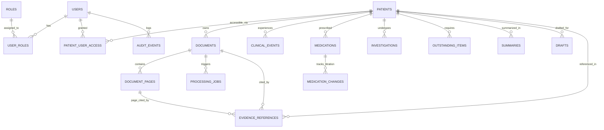

# 🗄️ MedBrief AI — Database Foundation Specification

> **Phase**: Step 3 — Database Foundation  
> **Technology**: PostgreSQL / Supabase (with SQLite support for local offline development/testing)  
> **Engine**: SQLAlchemy 2.0+ ORM & Raw SQL Migrations  

---

## 1. Database Technology Overview

MedBrief AI uses a relational database architecture optimized for **PostgreSQL** and fully compatible with **Supabase**. The database enforces strict relational integrity, UUID primary keys, check constraints, foreign keys with safe deletion policies, and targeted B-tree indexes for low-latency clinical lookups.

### Dialect Compatibility
- **Production & Cloud**: PostgreSQL 15+ / Supabase managed Postgres.
- **Local Development & Automated CI**: Seamless fallback to local SQLite (`sqlite:///./medbrief_dev.db`) via [src/backend/db/connection.py](file:///C:/Users/Dell/OneDrive/Desktop/MedBrief-AI/src/backend/db/connection.py) to enable zero-dependency unit and regression testing without requiring external Docker services.

---

## 2. Conceptual Entity-Relationship Diagram



---

## 3. Database Tables & Schema Specifications

The schema comprises exactly **17 core tables** supporting the end-to-end clinical workflow:

### 1. `roles`
Defines clinical and administrative access roles for future RBAC.
- **Columns**: `id (UUID, PK)`, `name (VARCHAR, UNIQUE)`, `description (TEXT)`, `created_at (TIMESTAMP)`.
- **Predefined Roles**: `doctor`, `admin`.

### 2. `users`
Clinician and administrator user profiles.
- **Columns**: `id (UUID, PK)`, `email (VARCHAR, UNIQUE, INDEX)`, `display_name (VARCHAR)`, `role_title (VARCHAR)`, `medical_license_id (VARCHAR)`, `is_active (BOOLEAN)`, `created_at (TIMESTAMP)`, `updated_at (TIMESTAMP)`.
- **Supabase Integration**: Designed so `id` can map 1:1 with `auth.users.id`.

### 3. `user_roles`
Many-to-many junction table associating users with roles.
- **Columns**: `id (UUID, PK)`, `user_id (UUID, FK -> users.id, CASCADE)`, `role_id (UUID, FK -> roles.id, CASCADE)`, `assigned_at (TIMESTAMP)`.
- **Constraint**: `UNIQUE (user_id, role_id)`.

### 4. `patients`
Patient demographic dossiers.
- **Columns**: `id (UUID, PK)`, `mrn (VARCHAR, UNIQUE, INDEX)`, `first_name (VARCHAR)`, `last_name (VARCHAR)`, `date_of_birth (DATE, NULLABLE)`, `gender (VARCHAR, NULLABLE)`, `contact_phone (VARCHAR, NULLABLE)`, `status (VARCHAR)`, `created_by (UUID, FK -> users.id, SET NULL)`, `created_at (TIMESTAMP, INDEX)`, `updated_at (TIMESTAMP)`, `archived_at (TIMESTAMP, NULLABLE)`.
- **Status Values**: `ACTIVE`, `INACTIVE`, `ARCHIVED`, `DECEASED`.

### 5. `patient_user_access`
Explicit clinician-patient authorization mappings.
- **Columns**: `id (UUID, PK)`, `patient_id (UUID, FK -> patients.id, CASCADE)`, `user_id (UUID, FK -> users.id, CASCADE)`, `access_role (VARCHAR)`, `created_at (TIMESTAMP)`, `updated_at (TIMESTAMP)`.
- **Constraint**: `UNIQUE (patient_id, user_id)`.
- **Roles**: `PRIMARY_PHYSICIAN`, `CONSULTANT`, `CARE_TEAM`, `READ_ONLY`, `ADMIN`.

### 6. `documents`
Uploaded medical records and reports.
- **Columns**: `id (UUID, PK)`, `patient_id (UUID, FK -> patients.id, RESTRICT)`, `uploaded_by (UUID, FK -> users.id, SET NULL)`, `file_name (VARCHAR)`, `file_type (VARCHAR)`, `storage_path (TEXT)`, `document_type (VARCHAR)`, `file_size (BIGINT)`, `page_count (INTEGER)`, `checksum_sha256 (VARCHAR, NULLABLE)`, `status (VARCHAR)`, `uploaded_at (TIMESTAMP)`, `created_at (TIMESTAMP, INDEX)`, `updated_at (TIMESTAMP)`, `archived_at (TIMESTAMP, NULLABLE)`.
- **Status Values**: `UPLOADED`, `PROCESSING`, `PROCESSED`, `FAILED`, `PARTIAL`, `REQUIRES_REVIEW`, `ARCHIVED`.
- **Document Types**: `DISCHARGE_SUMMARY`, `CLINIC_CONSULTATION`, `LAB_PATHOLOGY`, `RADIOLOGY_REPORT`, `PRESCRIPTION`, `REFERRAL_LETTER`, `OTHER`.

### 7. `document_pages`
Page-level segmented text supporting granular source verification.
- **Columns**: `id (UUID, PK)`, `document_id (UUID, FK -> documents.id, CASCADE)`, `page_number (INTEGER)`, `extracted_text (TEXT, NULLABLE)`, `ocr_applied (BOOLEAN)`, `processing_status (VARCHAR)`, `created_at (TIMESTAMP)`, `updated_at (TIMESTAMP)`.
- **Constraint**: `UNIQUE (document_id, page_number)`.
- **Status Values**: `PENDING`, `EXTRACTED`, `FAILED`.

### 8. `processing_jobs`
Asynchronous pipeline queue tracking.
- **Columns**: `id (UUID, PK)`, `document_id (UUID, FK -> documents.id, CASCADE)`, `job_type (VARCHAR)`, `status (VARCHAR)`, `progress (INTEGER, 0-100)`, `total_pages (INTEGER)`, `processed_pages (INTEGER)`, `error_message (TEXT, NULLABLE)`, `retry_count (INTEGER)`, `started_at (TIMESTAMP, NULLABLE)`, `completed_at (TIMESTAMP, NULLABLE)`, `created_at (TIMESTAMP, INDEX)`, `updated_at (TIMESTAMP)`.
- **Status Values**: `QUEUED`, `PROCESSING`, `COMPLETED`, `FAILED`, `PARTIAL`, `REQUIRES_REVIEW`.

### 9. `clinical_events`
Chronological clinical timeline events.
- **Columns**: `id (UUID, PK)`, `patient_id (UUID, FK -> patients.id, RESTRICT)`, `event_type (VARCHAR, INDEX)`, `event_date (TIMESTAMP, NULLABLE, INDEX)`, `event_date_precision (VARCHAR)`, `title (VARCHAR)`, `description (TEXT)`, `source_document_id (UUID, FK -> documents.id, SET NULL)`, `source_page_id (UUID, FK -> document_pages.id, SET NULL)`, `confidence (FLOAT, NULLABLE)`, `is_ai_generated (BOOLEAN)`, `is_conflict (BOOLEAN)`, `conflict_details (TEXT, NULLABLE)`, `review_status (VARCHAR)`, `created_at (TIMESTAMP)`, `updated_at (TIMESTAMP)`.
- **Precision Enum**: `EXACT`, `APPROXIMATE`, `MONTH_YEAR`, `YEAR_ONLY`, `UNKNOWN`.
- **Review Status**: `UNREVIEWED`, `VERIFIED`, `REJECTED`.

### 10. `medications`
Active and historical pharmacotherapy regimens.
- **Columns**: `id (UUID, PK)`, `patient_id (UUID, FK -> patients.id, RESTRICT)`, `medication_name (VARCHAR)`, `generic_name (VARCHAR, NULLABLE)`, `dosage (VARCHAR, NULLABLE)`, `dose_unit (VARCHAR, NULLABLE)`, `route (VARCHAR, NULLABLE)`, `frequency (VARCHAR, NULLABLE)`, `status (VARCHAR)`, `start_date (DATE, NULLABLE)`, `end_date (DATE, NULLABLE)`, `source_document_id (UUID, FK -> documents.id, SET NULL)`, `source_page_id (UUID, FK -> document_pages.id, SET NULL)`, `created_at (TIMESTAMP)`, `updated_at (TIMESTAMP)`.
- **Status Values**: `ACTIVE`, `STOPPED`, `HISTORICAL`, `UNKNOWN`.

### 11. `medication_changes`
Immutable audit log of drug titrations, starts, and discontinuations.
- **Columns**: `id (UUID, PK)`, `medication_id (UUID, FK -> medications.id, RESTRICT)`, `change_type (VARCHAR)`, `previous_value (VARCHAR, NULLABLE)`, `new_value (VARCHAR, NULLABLE)`, `change_date (DATE, NULLABLE, INDEX)`, `reason (TEXT, NULLABLE)`, `source_document_id (UUID, FK -> documents.id, SET NULL)`, `source_page_id (UUID, FK -> document_pages.id, SET NULL)`, `is_ai_generated (BOOLEAN)`, `review_status (VARCHAR)`, `created_at (TIMESTAMP)`.
- **Change Types**: `STARTED`, `STOPPED`, `DOSE_CHANGED`, `FREQUENCY_CHANGED`, `ROUTE_CHANGED`, `OTHER`.

### 12. `investigations`
Diagnostic lab, pathology, and radiology tests.
- **Columns**: `id (UUID, PK)`, `patient_id (UUID, FK -> patients.id, RESTRICT)`, `investigation_name (VARCHAR)`, `investigation_type (VARCHAR)`, `ordered_date (DATE, NULLABLE, INDEX)`, `completed_date (DATE, NULLABLE)`, `status (VARCHAR)`, `result_summary (TEXT, NULLABLE)`, `reference_range (VARCHAR, NULLABLE)`, `is_abnormal (BOOLEAN, NULLABLE)`, `clinical_urgency (VARCHAR)`, `source_document_id (UUID, FK -> documents.id, SET NULL)`, `source_page_id (UUID, FK -> document_pages.id, SET NULL)`, `created_at (TIMESTAMP)`, `updated_at (TIMESTAMP)`.
- **Status Values**: `ORDERED`, `PENDING`, `COMPLETED`, `CANCELLED`, `UNKNOWN`.
- **Urgency Levels**: `LOW`, `NORMAL`, `HIGH`, `CRITICAL`.

### 13. `outstanding_items`
Actionable clinical follow-up and monitoring items.
- **Columns**: `id (UUID, PK)`, `patient_id (UUID, FK -> patients.id, RESTRICT)`, `item_type (VARCHAR)`, `title (VARCHAR)`, `description (TEXT, NULLABLE)`, `priority (VARCHAR, INDEX)`, `status (VARCHAR, INDEX)`, `due_date (DATE, NULLABLE)`, `source_document_id (UUID, FK -> documents.id, SET NULL)`, `source_page_id (UUID, FK -> document_pages.id, SET NULL)`, `is_ai_generated (BOOLEAN)`, `review_status (VARCHAR)`, `created_at (TIMESTAMP)`, `updated_at (TIMESTAMP)`.
- **Item Types**: `PENDING_INVESTIGATION`, `FOLLOW_UP`, `MEDICATION_REVIEW`, `SPECIALIST_FOLLOW_UP`, `MONITORING`, `DOCUMENTATION`, `OTHER`.
- **Status Values**: `OPEN`, `IN_PROGRESS`, `RESOLVED`, `DISMISSED`.

### 14. `summaries`
Synthesized clinical summaries with multi-mode support.
- **Columns**: `id (UUID, PK)`, `patient_id (UUID, FK -> patients.id, RESTRICT)`, `summary_type (VARCHAR, INDEX)`, `title (VARCHAR)`, `content (TEXT)`, `status (VARCHAR)`, `generated_by (UUID, FK -> users.id, SET NULL)`, `is_ai_generated (BOOLEAN)`, `model_name (VARCHAR, NULLABLE)`, `model_version (VARCHAR, NULLABLE)`, `reviewed_by (UUID, FK -> users.id, SET NULL)`, `reviewed_at (TIMESTAMP, NULLABLE)`, `created_at (TIMESTAMP, INDEX)`, `updated_at (TIMESTAMP)`.
- **Summary Types**: `QUICK_CLINICAL`, `DETAILED_CLINICAL`, `MEDICATION`, `INVESTIGATION`, `REFERRAL`, `DISCHARGE`, `HANDOFF`.
- **Status Values**: `DRAFT`, `GENERATED`, `REVIEWED`, `APPROVED`, `ARCHIVED`.

### 15. `evidence_references`
Bi-directional citation links from any clinical entity to source PDF page.
- **Columns**: `id (UUID, PK)`, `patient_id (UUID, FK -> patients.id, CASCADE)`, `document_id (UUID, FK -> documents.id, CASCADE)`, `document_page_id (UUID, FK -> document_pages.id, SET NULL)`, `parent_entity_type (VARCHAR)`, `parent_entity_id (UUID)`, `source_section (VARCHAR, NULLABLE)`, `source_text (TEXT)`, `source_type (VARCHAR)`, `confidence (FLOAT, NULLABLE)`, `char_start (INTEGER, NULLABLE)`, `char_end (INTEGER, NULLABLE)`, `created_at (TIMESTAMP)`.
- **Parent Types**: `CLINICAL_EVENT`, `MEDICATION`, `MEDICATION_CHANGE`, `INVESTIGATION`, `OUTSTANDING_ITEM`, `SUMMARY`, `DRAFT`.

### 16. `drafts`
AI-generated clinical draft letters awaiting physician review and sign-off.
- **Columns**: `id (UUID, PK)`, `patient_id (UUID, FK -> patients.id, RESTRICT)`, `draft_type (VARCHAR, INDEX)`, `title (VARCHAR)`, `content (TEXT)`, `status (VARCHAR, INDEX)`, `created_by (UUID, FK -> users.id, SET NULL)`, `generated_by_ai (BOOLEAN)`, `model_name (VARCHAR, NULLABLE)`, `model_version (VARCHAR, NULLABLE)`, `reviewed_by (UUID, FK -> users.id, SET NULL)`, `reviewed_at (TIMESTAMP, NULLABLE)`, `created_at (TIMESTAMP)`, `updated_at (TIMESTAMP)`.
- **Draft Types**: `REFERRAL`, `DISCHARGE`, `HANDOFF`, `CONSULTATION_NOTE`.
- **Status Values**: `DRAFT`, `IN_REVIEW`, `APPROVED`, `ARCHIVED`.

### 17. `audit_events`
Immutable access and operation audit records.
- **Columns**: `id (UUID, PK)`, `user_id (UUID, FK -> users.id, SET NULL, INDEX)`, `action (VARCHAR)`, `resource_type (VARCHAR)`, `resource_id (VARCHAR, NULLABLE)`, `metadata_json (TEXT, NULLABLE)`, `created_at (TIMESTAMP, INDEX)`.

---

## 4. Delete & Retention Strategy (Safety Guardrails)

In medical systems, accidental deletion of clinical records can have catastrophic legal and clinical consequences:
1. **No Cascading Deletion of Medical History**: The `patients` and `documents` tables use `ON DELETE RESTRICT` for clinical events, medications, investigations, and summaries.
2. **Soft-Delete via `status` and `archived_at`**: When a record is retired or marked inactive, its status is updated to `'ARCHIVED'` and `archived_at = CURRENT_TIMESTAMP`. The record remains queryable for auditing and historical review.
3. **Safe Junction Purging**: Auxiliary records directly tied to an uploaded binary (such as `document_pages` or `processing_jobs`) cascade if and only if an administrator explicitly purges an erroneous raw document file.

---

## 5. Indexes & Query Performance

Targeted B-tree indexes are created for all high-volume access patterns:
- Multi-document retrieval: `idx_documents_patient (patient_id)`, `idx_doc_pages_lookup (document_id, page_number)`.
- Timeline queries: `idx_clinical_events_patient (patient_id)`, `idx_clinical_events_date (event_date)`.
- Medication changes: `idx_med_changes_med (medication_id)`, `idx_med_changes_date (change_date)`.
- Evidence lookups: `idx_evidence_parent (parent_entity_type, parent_entity_id)`.
- Job polling: `idx_processing_jobs_doc (document_id)`, `idx_processing_jobs_status (status)`.
- Auditing: `idx_audit_resource (resource_type, resource_id)`, `idx_audit_created_at (created_at)`.

---

## 6. Migration & Seeding Strategy

### Migration Files
- [src/backend/db/migrations/001_initial_schema.sql](file:///C:/Users/Dell/OneDrive/Desktop/MedBrief-AI/src/backend/db/migrations/001_initial_schema.sql): Pure PostgreSQL DDL migration creating all 17 tables, check constraints, unique keys, and indexes. Can be executed directly in the Supabase SQL editor or via CLI.
- [src/backend/db/migrations/002_seed_demo_data.sql](file:///C:/Users/Dell/OneDrive/Desktop/MedBrief-AI/src/backend/db/migrations/002_seed_demo_data.sql): Strictly fictional demo/test dataset with synthetic patient "Johnathan Doe" (MRN `DEMO-MRN-2026-0042`), post-NSTEMI clinical events, medication titrations, and evidence linkages.

### Python Execution
- Automatic schema creation on application startup via FastAPI lifespan hook.
- Manual execution helper:
  ```bash
  # Initialize tables only
  python -m src.backend.db.init_db

  # Initialize tables and seed demo data
  python -m src.backend.db.init_db --seed
  ```

---

## 7. Future Row Level Security (RLS) Preparation

When Supabase Authentication is introduced in Step 4:
1. `users.id` will reference Supabase's `auth.users(id)`.
2. Supabase RLS policies will query `patient_user_access`:
   ```sql
   CREATE POLICY "Physician can view assigned patients"
   ON patients
   FOR SELECT
   USING (
       EXISTS (
           SELECT 1 FROM patient_user_access
           WHERE patient_user_access.patient_id = patients.id
             AND patient_user_access.user_id = auth.uid()
       )
   );
   ```
3. Child entities (`documents`, `clinical_events`, `medications`) will inherit access controls via their `patient_id` foreign key.
